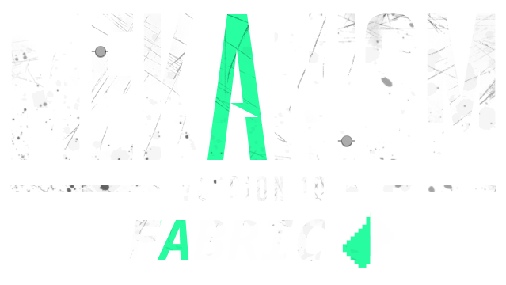

# Mekanism for Fabric, Minecraft 1.20 #

This is a port of the popular tech mod [Mekanism]() for the Fabric mod loader. The project aims to achieve full feature and content parity with the original Forge version, and stay updated to the most popular and recent versions of minecraft. Any inconsistencies or bugs should be reported as an issue.

# What is Mekanism? #

Mekanism is an independent Minecraft add-on featuring high-tech machinery that can be used to create powerful tools, 
armor, and weapons. You can find more detail on the features on the [**Official Website**](http://aidancbrady.com/mekanism/).
With features ranging from jetpacks and balloons to factories and energy cubes, the mod does not have a single unifying goal.
Nevertheless, these features combine coherently to create a rich gameplay experience that players will enjoy.

Mekanism uses a tier-based system to organize the majority of its core features, like energy cubes and factories.
There are four tiers: basic, advanced, elite, and ultimate. Players can upgrade their components to the next tier
by placing each component in a crafting grid and surrounding it with the necessary resources for the upgrade or in
world by using tier installers.

After using Mekanism for a while, players can obtain a near-indestructible suit of Refined Obsidian Armor, receive five 
ingots for each ore mined, fly with hydrogen-powered jetpacks, and have cute robotic friends following them around while they mine. :)

- [Mekanism Repository](https://github.com/mekanism/Mekanism)
- [Mekanism CurseForge](https://www.curseforge.com/minecraft/mc-mods/mekanism)
- [Mekanism Official Website](http://aidancbrady.com/mekanism/)

# License #

Mekanism is licensed under the MIT license. You may use it in modpacks, reviews, or any other form as long as you abide by the terms below. 

Copyright 2017-2023 TinyPandas

Permission is hereby granted, free of charge, to any person obtaining a copy of this software and associated documentation files (the "Software"), to deal in the Software without restriction, including without limitation the rights to use, copy, modify, merge, publish, distribute, sublicense, and/or sell copies of the Software, and to permit persons to whom the Software is furnished to do so, subject to the following conditions:

The above copyright notice and this permission notice shall be included in all copies or substantial portions of the Software.

THE SOFTWARE IS PROVIDED "AS IS", WITHOUT WARRANTY OF ANY KIND, EXPRESS OR IMPLIED, INCLUDING BUT NOT LIMITED TO THE WARRANTIES OF MERCHANTABILITY, FITNESS FOR A PARTICULAR PURPOSE AND NONINFRINGEMENT. IN NO EVENT SHALL THE AUTHORS OR COPYRIGHT HOLDERS BE LIABLE FOR ANY CLAIM, DAMAGES OR OTHER LIABILITY, WHETHER IN AN ACTION OF CONTRACT, TORT OR OTHERWISE, ARISING FROM, OUT OF OR IN CONNECTION WITH THE SOFTWARE OR THE USE OR OTHER DEALINGS IN THE SOFTWARE.

# Credits #

- TinyPandas | [Discord](https://discordapp.com/users/169208961533345792)
- heroku | [Discord](https://discordapp.com/users/728848401416061089)
